**Whiskey Papa** 🥃 is a demonstration __workflow processing__ pipeline and dashboard built on Hatchet Cloud. It showcases a real-time UX optimized workflow orchestration dashboard with concurrent Go workers, Server Sent Events, polling, usage of EventSource API, and automatic localStorage persistence.

## Screenshots


## Technical Highlights
<details>
  <summary>🛠️ Tech Stack & Tooling</summary>

  **Backend (Workers)**
  - Go 1.25.4 with Hatchet Go SDK
  - Two workflow patterns: DAG (parallel) + Linear (sequential)
  - Simulated document/invoice processing pipelines

  **Frontend/Backend**
  - Next.js 15 (App Router) + React 19
  - TypeScript 5 (full-stack type safety)
  - Tailwind CSS 4 for styling
  - Hatchet TypeScript SDK for workflow orchestration

  **Integration Layer**
  - Server-Sent Events (SSE) for real-time updates
  - REST API via Next.js API routes
  - LocalStorage for persistent workflow history

</details>

<details>
  <summary>⚙️ Real-Time Workflow Monitoring</summary>

  **Server-Sent Events (SSE) Implementation**
  - Server-side polling (1s interval) wrapped in ReadableStream
  - Automatic status change detection and push to client
  - Browser EventSource API with auto-reconnection
  - Multiple concurrent SSE connections for parallel workflow tracking
  - Graceful cleanup on terminal status (COMPLETED/FAILED/CANCELLED)

  **Live Dashboard Updates**
  - `useWorkflowStream()` hook manages SSE subscriptions per workflow
  - `useElapsedTime()` hook provides live timer for active runs
  - Real-time status transitions (QUEUED → RUNNING → COMPLETED)
  - Zero manual refresh required
  - Automatic localStorage persistence on completion

</details>

<details>
  <summary>🎨 Progressive Disclosure UX</summary>

  **Information Hierarchy Design**
  - **Question 1**: "Did the workflow succeed?" ➡️ Large status pill in header (45.2s • 12/12 steps)
  - **Question 2**: "Which step is slow?" ➡️ Steps list with queue time vs run time separation
  - **Question 3**: "Why did it fail?" ➡️ Activity log in separate section
  - **Question 4**: "Show me the DAG" ➡️ Explicit button action (not default view)

  **Parallel Step Grouping Algorithm**
  - Automatic detection using Hatchet's `shape` array (parent-child relationships)
  - Steps with same parent = parallel execution group
  - Collapsible group headers with total duration
  - Slowest step in each group gets "⚠️ Slowest" badge
  - Reduces visual noise while highlighting bottlenecks

  **Visual Design Patterns**
  - Queue time (⏱️) vs Run time (⚡) separated with distinct icons
  - Color-coded status pills (green/red/yellow) for instant recognition
  - Error messages surfaced inline with failed steps (not buried in logs)
  - Empty states for zero-data scenarios
  - Consistent header layout between success/failure runs

</details>

<details>
  <summary>📐 Application Structure</summary>

    ```bash
      frontend/
      ├── app/
      │   ├── page.tsx                    # Dashboard (main page)
      │   ├── runs/[id]/page.tsx          # Run detail page
      │   ├── api/
      │   │   ├── workflows/
      │   │   │   ├── trigger/route.ts    # POST - Trigger workflow
      │   │   │   ├── runs/route.ts       # GET - List all runs
      │   │   │   ├── runs/[id]/route.ts  # GET - Get run details
      │   │   │   └── stream/[runId]/route.ts  # GET - SSE stream
      │   │   └── metrics/route.ts        # GET - Platform metrics
      │   └── hooks/
      │       ├── useWorkflowStream.ts    # SSE subscription hook
      │       ├── useCompletedWorkflows.ts # LocalStorage history
      │       ├── useMetrics.ts           # Platform health data
      │       └── useElapsedTime.ts       # Live timer for active runs
      ├── components/
      │   ├── platformhealth/             # Health metrics cards
      │   ├── activeworkflows/            # Live workflow list
      │   ├── recentrunslist/             # History list
      │   ├── singlerunheader/            # Run detail header
      │   ├── singlerunstepsection/       # Workflow steps with grouping
      │   └── singlerunactivitylog/       # Event log viewer
      └── lib/
          └── hatchet/
              ├── client.ts               # Singleton Hatchet client
              ├── types.ts                # TypeScript interfaces
              └── transformers/
                  └── runTransformer.ts   # Hatchet data → UI data
    ```
</details>

<details>
  <summary>🏗️ Architecture & Performance</summary>

**Systems Diagram**

```mermaid
flowchart TB
  subgraph Browser["🌐 Browser (React)"]
      Dashboard["📊 Dashboard Page"]
      RunDetail["📄 Run Detail Page"]
      LocalStorage[("💾 LocalStorage<br/>(History)")]
  end

  subgraph NextJS["⚡ Next.js API Routes"]
      Trigger["/api/workflows/trigger<br/>(POST)"]
      RunsID["/api/workflows/runs/[id]<br/>(GET)"]
      Stream["/api/workflows/stream/[runId]<br/>(SSE polling)"]
      Metrics["/api/metrics<br/>(GET)"]
      SDK["🔧 Hatchet TS SDK<br/>(Singleton)"]
  end

  subgraph HatchetCloud["☁️ Hatchet Cloud"]
      Engine["⚙️ Workflow Engine"]
      Queue["📋 Task Queue"]
      EventStore["📦 Event Store"]
  end

  subgraph Workers["🔨 Go Workers"]
      DAGDemo["dag-demo<br/>(Parallel DAG)"]
      InvoiceFail["invoice-fail<br/>(Linear Failure)"]
      Analyzer["analyzer<br/>(Reserved)"]
  end

  %% Browser to API Routes
  Dashboard -->|HTTP| Trigger
  Dashboard -->|HTTP| Metrics
  RunDetail -->|HTTP| RunsID
  Dashboard -->|EventSource| Stream

  %% API Routes to SDK
  Trigger --> SDK
  RunsID --> SDK
  Stream --> SDK
  Metrics --> SDK

  %% SDK to Hatchet Cloud
  SDK -->|gRPC/REST| Engine
  SDK -->|gRPC/REST| Queue
  SDK -->|gRPC/REST| EventStore

  %% Hatchet Cloud to Workers
  Engine -->|gRPC| DAGDemo
  Engine -->|gRPC| InvoiceFail
  Engine -->|gRPC| Analyzer

  %% Workers emit events back
  DAGDemo -.->|Emit events| EventStore
  InvoiceFail -.->|Emit events| EventStore
  Analyzer -.->|Emit events| EventStore

  %% LocalStorage persistence
  Stream -.->|Write on complete| LocalStorage

  %% Styling
  classDef browserStyle fill:#e3f2fd,stroke:#1976d2,stroke-width:2px
  classDef apiStyle fill:#f3e5f5,stroke:#7b1fa2,stroke-width:2px
  classDef cloudStyle fill:#fff3e0,stroke:#f57c00,stroke-width:2px
  classDef workerStyle fill:#e8f5e9,stroke:#388e3c,stroke-width:2px

  class Dashboard,RunDetail,LocalStorage browserStyle
  class Trigger,RunsID,Stream,Metrics,SDK apiStyle
  class Engine,Queue,EventStore cloudStyle
  class DAGDemo,InvoiceFail,Analyzer workerStyle
```



  **Singleton Hatchet Client**
  - Module-level singleton with lazy initialization in `lib/hatchet/client.ts`
  - Connection pooling reused across all API requests
  - Node.js module caching ensures persistence across requests
  - Eliminates repeated auth handshakes and initialization overhead

  **Data Transformation Layer**
  - `runTransformer.ts` normalizes Hatchet SDK responses for UI consumption
  - Parent map construction from `shape` array for DAG structure
  - Parallel group detection via sibling analysis (shared parent)
  - Queue time vs run time calculation per step
  - TaskEvents → ActivityLog transformation with level mapping

  **LocalStorage Persistence**
  - Auto-save completed workflows to `whiskey-papa-completed-workflows` key
  - Keeps last 20 runs (configurable MAX_HISTORY)
  - Duplicate prevention via runId checking
  - Custom event dispatch (`workflowCompleted`) for cross-component sync
  - Polling + event listener pattern in `useCompletedWorkflows()` hook

  **Platform Health Metrics**
  - Success rate calculation: (succeeded / total) × 100
  - Queue depth from `hatchet.metrics.getQueueMetrics()`
  - Average duration: sum(durations) / count
  - Throughput: runs in last hour
  - Auto-refresh every 30s via `useMetrics()` hook

</details>

<details>
  <summary>🔧 Go Worker Patterns</summary>

  **DAG Demo (document-processing-pipeline)**
  - 12-step workflow with 2 parallel execution groups
  - Parallel Group 1: parse-text, parse-images, parse-tables
  - Parallel Group 2: store-database, store-s3, index-search
  - Parent-child dependencies via `Parents: []string{...}` in WorkflowStep
  - Simulated work with `time.Sleep(2-4s)` per step

  **Invoice Fail (invoice-processing-pipeline)**
  - 7-step linear workflow designed to fail at step 6
  - Demonstrates error propagation and downstream cancellation
  - Returns structured error: `fmt.Errorf("database connection timeout after 30s")`
  - Step 7 never executes (shows cancelled state in UI)

  **Worker Registration Pattern**
  1. Load `HATCHET_CLIENT_TOKEN` from environment
  2. Initialize Hatchet client with `client.New(client.WithToken(token))`
  3. Create worker with `worker.NewWorker()`
  4. Register workflow with `w.RegisterWorkflow(&worker.WorkflowJob{...})`
  5. Start worker with `w.Start()` and block with `select {}`

</details>


## Getting Started

Front End:
```bash
# 1. Clone the repository and navigate to the /frontend directory

# 2. Install dependencies
npm install

# 3. Visit https://hatchet.run and sign up for a free Hatchet Cloud account (https://cloud.onhatchet.run/auth/register)

# 4. On the main dashboard, find the sidebar, mouse down to "Settings > API Tokens > Create API Token"

# 5. Save this API token in a .env file in the root directory of the project

# 6. Add this token to your .env and .env.local files

npm run dev
```

Back End:
```bash
# 1. Navigate to the /workers

# 2. In both the /workers/dag-demo and /workers/invoice-fail directories, run:
go mod tidy

# 3. Take the API token from the front end and add it to the /workers/dag-demo/.env and /workers/invoice-fail/.env files

# 4. Fire up the workers in both directories:
go run main.go
```

## License
[GNU General Public License v2.0](https://www.gnu.org/licenses/old-licenses/gpl-2.0.en.html)

---

**Created by [Ahn Ming Loke](https://github.com/loke)**  • [LinkedIn](https://www.linkedin.com/in/ahnmingloke/)
